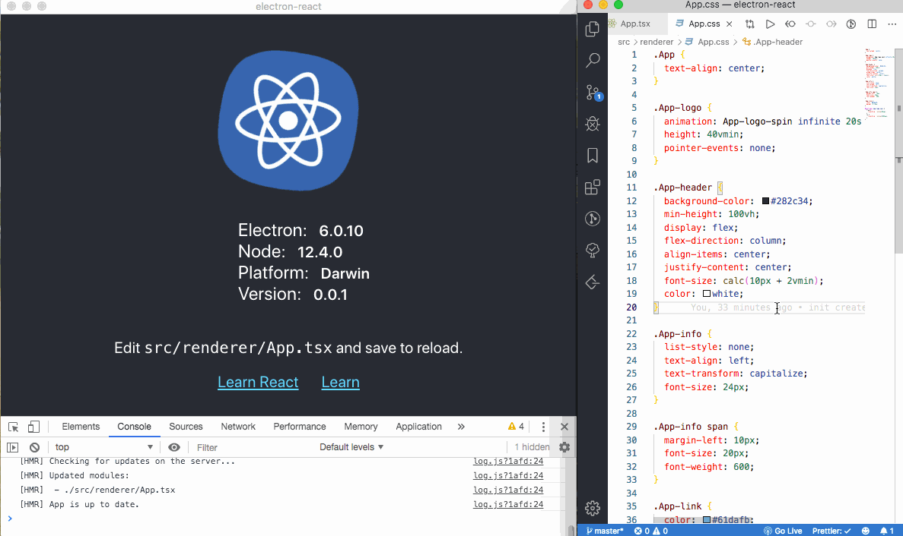

# create-electron-react

> A CLI for Electron & React.js to quick start boilerplate.

[](https://www.npmjs.com/package/create-electron-react)  [](https://standardjs.com)


## Intro

<p align="center">
  
</p>


## Features

- Easy-to-use CLI
- Handles all modern JS features
- [Jest](https://facebook.github.io/jest/) for unit testing
- [spectron](https://github.com/electron/spectron#readme) for E2E testing
- Support for TypeScript
- Base on react 16.9.0 && electron 6.0.8

## Install globally

This package requires `node >= 4`, but we recommend `node >= 8`.

```bash
npm install -g create-electron-react
```

## Usage with npx

```bash
npx create-electron-react
```

_([npx](https://medium.com/@maybekatz/introducing-npx-an-npm-package-runner-55f7d4bd282b) comes with npm 5.2+ and higher, see [instructions for older npm versions](https://gist.github.com/gaearon/4064d3c23a77c74a3614c498a8bb1c5f))_

## Creating a Electron React App

```bash
create-electron-react
```


## Thanks

- [electron-vue](https://github.com/SimulatedGREG/electron-vue)
- [transitive-bullshit/create-react-library](https://github.com/transitive-bullshit/create-react-library)
- and so on

## License
MIT © [zenghongtu](https://github.com/zenghongtu)
